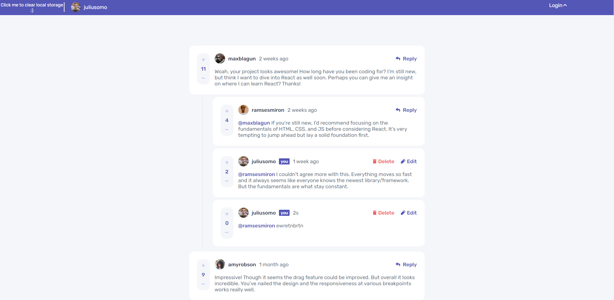

# Frontend Mentor - Interactive comments section solution

This is a solution to the [Interactive comments section challenge on Frontend Mentor](https://www.frontendmentor.io/challenges/interactive-comments-section-iG1RugEG9). Frontend Mentor challenges help you improve your coding skills by building realistic projects. 

## Table of contents

- [Overview](#overview)
  - [The challenge](#the-challenge)
  - [Screenshot](#screenshot)
  - [Links](#links)
- [My process](#my-process)
  - [Built with](#built-with)
  - [What I learned](#what-i-learned)
  - [Continued development](#continued-development)
  - [Useful resources](#useful-resources)
- [Author](#author)

## Overview

### The challenge

Users should be able to:

- View the optimal layout for the app depending on their device's screen size
- See hover states for all interactive elements on the page
- Create, Read, Update, and Delete comments and replies
- Upvote and downvote comments
- **Bonus**: If you're building a purely front-end project, use `localStorage` to save the current state in the browser that persists when the browser is refreshed.
- **Bonus**: Instead of using the `createdAt` strings from the `data.json` file, try using timestamps and dynamically track the time since the comment or reply was posted.
- **My Bonus**: Login options/clear local storage option/reasonably responsive width up to 320px/positioning of comment depending upon it's score 

### Screenshot

### Links

- Solution URL: [https://github.com/BartoszPie/CommentSection](https://your-solution-url.com)
- Live Site URL: [https://bartoszpie.github.io/CommentSection/](https://your-live-site-url.com)

## My process

### Built with

- Semantic HTML5 markup
- CSS custom properties
- Flexbox
- Pure JS
- JSON file

### What I learned

I was using JSON file first time, so i spent some time to really learn it and later on have fun with it :)

I created most of my code in js, so it would be generated based on local storage - that was new for me too.

### Continued development

That was my last project with pure JS so i was trying to use a lot of it for this website. Next is React and then angular 

### Useful resources

- I was trying to get along with chat GPT and using it made me work faster.

## Author

- GitHub - [Add your name here](https://github.com/BartoszPie)
- Frontend Mentor - [@BartoszPie](https://www.frontendmentor.io/profile/BartoszPie)